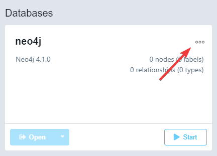
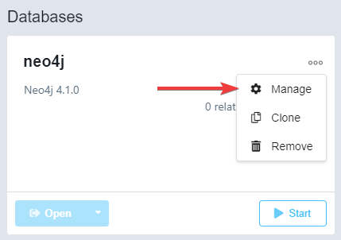
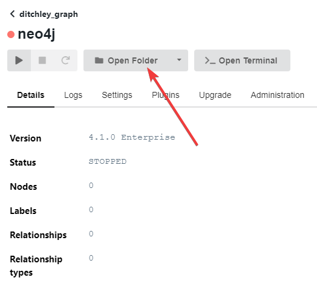
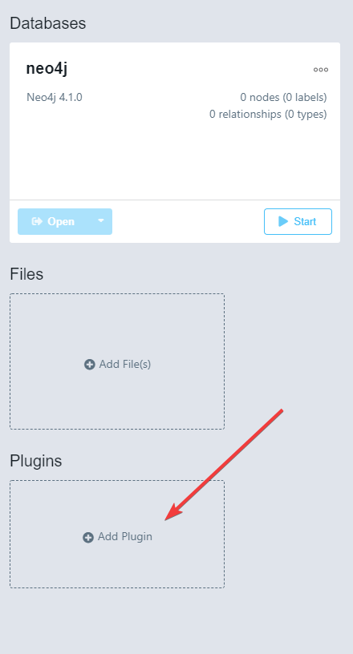

Project Environment Setup
=========================

Setting up the Python environment
---------------------------------
To create the bare-bones of the Python environment in  the Anaconda prompt, run the following:

.. code-block:: bash

    conda create -n lear python=3.6

Once the new environment has been created, switch into it using

.. code-block:: bash

    conda activate lear

To populate the environment with the required packages, simply run the following in the prompt while in the top level of the repo directory;

.. code-block:: bash

    pip install requirements.txt

Python dependencies
-------------------
Due to current dependency conflicts with py2neo, the project requires a python version at or below 3.7.1.

The primary module dependencies of this project are:

* twint
* nest_asyncio
* tweepy
* py2neo
* pandas
* numpy
* tqdm
* nltk
* gensim
* spacy
* beautifulsoup
* sklearn
* wordcloud
* wikipedia
* Sphinx
* sphinx_rtd_theme

The full list of package dependencies (including versions) which result from this main set can be found in the :ref:`required-modules`.

Jupyter Notebooks & Plotly
--------------------------
Plotly is a python module which is excellent for creating interactive plots that allow you to visually inspect data in a way that would be incredibly challenging in matplotlib.
To get plotly up-and-running in a Jupyter Notebook (or Jupyter Lab) requires a few extra bits and bobs.

In your conda environment, first install  plotly, node.js and the node package manager with:

.. code-block:: bash

    pip install plotly==4.9.0

    conda install nodejs

Then, to get going in Jupyter Notebook, run:

.. code-block:: bash

    pip install jupyterlab "ipywidgets>=7.5"

Or if you are using notebooks in Jupyter Lab:

.. code-block:: bash

    # JupyterLab renderer support
    jupyter labextension install jupyterlab-plotly@4.9.0

    # OPTIONAL: Jupyter widgets extension
    jupyter labextension install @jupyter-widgets/jupyterlab-manager plotlywidget@4.9.0

Neo4j Graph Database Directory
------------------------------
We found that Neo4j requires a few hoops to jump through to get off the ground and working.  

One of the biggest sticking points is the need to have data being loaded into the database in the same folder it belongs to.

First up, we need to find the directory where the graph lives. This is straightforward to do through the Neo4j desktop environment.

Find your graph and open the ``Manage`` panel.

Click on ``Open Folder`` to go straight to the graph directory.

From the directory that opens, you want to copy the filepath, which will look something like this:
``D:\neo4j\neo4jDatabases\database-47d324c5-ebe5-4afa-b595-e91969807b1b\installation-4.1.0``

Within this directory, we want to create a symbolic link inside the ``imports`` folder to our data directory.
On Windows 10, this is slightly convoluted, so we give an example below:

#. Open the command line prompt ``cmd`` *as an administrator*.
#. Run the command ``mklink /D graph-dir/import/data target-data-dir``
   For example: ``mklink /D D:\neo4j\neo4jDatabases\database-47d324c5-ebe5-4afa-b595-e91969807b1b\installation-4.1.0\import\data D:\Aug20_Ditchley\data``

If the link creation is successful, you're now good to go, start your graph and import data!

On Mac/Linux, the command for making the symbolic link would be something like:
``ln -s /mnt/neo4j/neo4jDatabases/database-47d324c5-ebe5-4afa-b595-e91969807b1b/installation-4.1.0/import/data /mnt/Aug20_Ditchley/data``

Neo4j Graph Database Plugins
----------------------------
We also need a couple of plugins (**APOC** and **Graph Data Science Library**) installed on the graph, which can be added from the plugins field in Neo4j Desktop indicated in the image below: 

