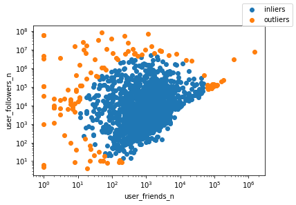
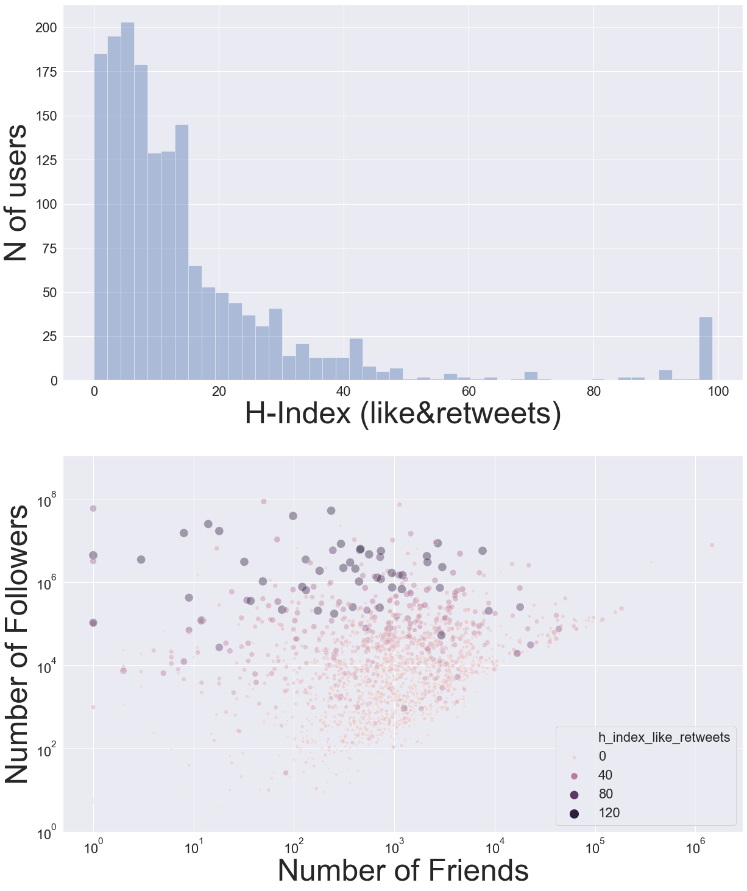

Statistical Analysis
--------------------
Part of the process of refining the list of users we want to include involves examining the distribution of user attributes.

Here, two metrics can be drawn from user profiles which can be used to weed out some celebrities and other accounts that are not relevant:

* the number of *friends* a user has and
* the number of *followers*.

Considered as a whole, the distribution of user profiles by friends an followers follows a log-normal distribution, and users at the extrema of this distribution are highly likely to be irrelevant.  By fitting a log-normal distribution, we can exclude the 5 percent of users who lie more than 2 standard deviations from the centre of the distribution, which helps filter out accounts of little interest.  An example of the code for this below:

.. code-block:: python

    from src.graph_database import graphdb as gdb

    # This function calculate the chisquare for each user
    no_loners = gdb.get_chi2(users_df)

    #We can then classify each user as an inlier or outlier based on their chisquare value
    inliers = no_loners[no_loners['chi2']<6.18]
    outliers = no_loners[no_loners['chi2']>6.18]

The Twitter h-index
-------------------
Another metric that we can use to gain further insight into the users we are investigating derives from their tweets and how well they engage with their audience.  

From the world of academic publishing, we have (controversially) adopted the use of the *h-index*, which is a measure of the volume of engagement for each person.

In the context of Twitter, the h-index of a user is the largest number of tweets, N, that have at least N retweets or likes.

